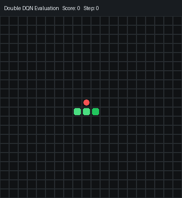
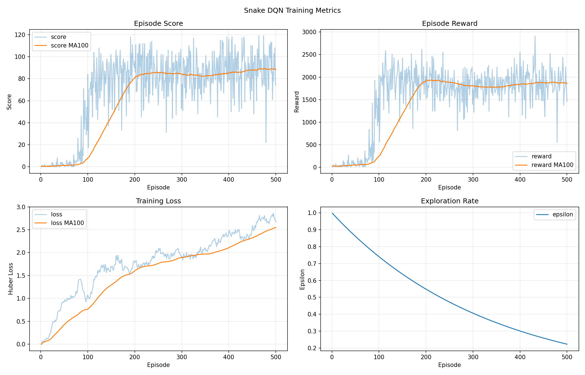

# Snake RL - Double DQN

[Tiếng Việt](README.vi.md)

This project trains an AI agent to play Snake with Deep Reinforcement Learning. The goal is to help the snake eat food, avoid death, reduce self-trapping behavior, and reach the highest score possible.



## Main Technologies

- Python: builds the Snake environment, training script, and evaluation script.
- PyTorch: builds and trains the neural network.
- Deep Q-Network: learns an action policy from Q-values.
- Double DQN: reduces Q-value overestimation by using the online network to select the next action and the target network to evaluate it.
- Replay Buffer: stores past experiences and samples random batches for more stable training.
- Target Network: stabilizes Q-learning targets during training.
- Epsilon-Greedy: balances exploration and exploitation.
- Reward Shaping: rewards and penalties guide the snake to eat food while avoiding self-traps.
- Action Masking: removes immediately dangerous actions, and avoids narrow regions when safer choices exist.
- Flood Fill: estimates reachable free space after each action.
- Matplotlib: saves score, reward, loss, and epsilon charts during training.
- Pygame: renders the game during evaluation or demos.

## Project Structure

```text
agents/
  dqn_agent.py        # DQN agent, Double DQN, action masking
  replay_buffer.py    # Replay memory
environment/
  snake_env.py        # Snake environment, state, reward, collision, flood fill
models/
  qnet.py             # Q-network model
renderer/
  pygame_renderer.py  # Pygame renderer
train.py              # Train the model
evaluate.py           # Evaluate a checkpoint
checkpoints/          # Saved models
logs/                 # Metrics, summaries, and training charts
```

`checkpoints/` and `logs/` are created automatically by `train.py`. They are ignored by Git because model files and training logs can become large. Sample documentation images are stored in `assets/`.

## How It Works

1. `SnakeEnv` creates the current game state.
2. `DQNAgent` selects one of three actions: go straight, turn right, or turn left.
3. The environment applies the action and returns the next state, reward, and done flag.
4. Each experience `(state, action, reward, next_state, done)` is stored in the replay buffer.
5. The agent samples batches from replay memory to train the Q-network.
6. The target network is updated periodically to stabilize learning.
7. The best scoring model is saved as a checkpoint.

## State

The environment returns a state vector that describes the current snake situation. The main feature groups are:

- Danger straight ahead, to the right, and to the left.
- Current snake direction.
- Food position relative to the snake head.
- Wall position.
- Body or tail position near the head.
- Reachable free space after each action.
- Head position on the board.
- Snake length ratio relative to the board size.
- Distance to food.

## Reward

The reward is shaped to avoid purely greedy food chasing that can trap the snake:

- Death: large penalty.
- Eating food: large reward.
- Each move: small penalty to discourage endless loops.
- Enough reachable space: small reward.
- Moving into a narrow region: penalty.
- Still able to reach the tail: small reward.
- Losing a path to the tail: penalty.
- Moving closer to food is rewarded only if the action keeps enough safe space.

## Installation

Install the required libraries:

```powershell
pip install -r requirements.txt
```

If you only train without rendering the game, `pygame` is optional. `evaluate.py` can still run without rendering.

## Training

Default training:

```powershell
python train.py
```

Current defaults:

- `SNAKE_EPISODES=500`
- `SNAKE_BATCH_SIZE=512`
- `SNAKE_LONG_UPDATES=50`
- `SNAKE_EXACT_SPACE=1`

Train for 500 episodes:

```powershell
$env:SNAKE_EPISODES="500"
$env:SNAKE_RUN_NAME="reward_safety_500eps"
python train.py
```

Train for longer:

```powershell
$env:SNAKE_EPISODES="3000"
$env:SNAKE_RUN_NAME="reward_safety_3000eps"
python train.py
```

Resume from the best checkpoint:

```powershell
$env:SNAKE_RESUME="1"
$env:SNAKE_EPISODES="1000"
python train.py
```

Resume from a specific checkpoint:

```powershell
$env:SNAKE_RESUME_MODEL="checkpoints/snake_dqn_1000.pth"
$env:SNAKE_EPISODES="1000"
python train.py
```

## Checkpoints

Models are saved in the `checkpoints/` directory.

- `snake_dqn_best.pth`: best model in the current training run.
- `snake_dqn_100.pth`, `snake_dqn_200.pth`, ...: periodic checkpoints saved every 100 episodes.

`snake_dqn_best.pth` is overwritten when an episode reaches a higher score than the current best score of the run.

The `checkpoints/` directory is generated automatically and is not committed to this repository.

## Evaluation

Evaluate the default model:

```powershell
python evaluate.py
```

Evaluate without rendering:

```powershell
$env:SNAKE_EVAL_RENDER="0"
python evaluate.py
```

Evaluate a specific checkpoint:

```powershell
$env:SNAKE_EVAL_MODEL="checkpoints/snake_dqn_best.pth"
python evaluate.py
```

Limit the number of evaluation steps:

```powershell
$env:SNAKE_EVAL_MAX_STEPS="20000"
python evaluate.py
```

## Logs and Charts

Each training run creates a directory in `logs/`:

```text
logs/run_YYYYMMDD_HHMMSS/
```

Generated files:

- `metrics.csv`: per-episode training log.
- `summary.txt`: final run summary.
- `training_metrics.png`: score, reward, loss, and epsilon charts.
- `learning_curve.png`: moving-average score and reward chart.

The `logs/` directory is generated automatically and is not committed to this repository.

Main columns in `metrics.csv`:

- `episode`
- `score`
- `reward`
- `loss`
- `epsilon`
- `train_steps`
- `best_score`

## Sample Results

A 500-episode training run reached:

| Metric | Value |
|---|---:|
| Best score | 119 |
| Final score MA100 | 88.350 |
| Final reward MA100 | 1859.145 |
| Final loss MA100 | 2.548440 |
| Final epsilon | 0.222628 |



## Important Environment Variables

| Variable | Default | Meaning |
|---|---:|---|
| `SNAKE_EPISODES` | `500` | Number of episodes in one training run |
| `SNAKE_BATCH_SIZE` | `512` | Training batch size |
| `SNAKE_LONG_UPDATES` | `50` | Extra training updates after each episode |
| `SNAKE_EXACT_SPACE` | `1` | `1` uses exact flood fill, `0` uses a faster local approximation |
| `SNAKE_RUN_NAME` | timestamp | Log directory name |
| `SNAKE_LOG_DIR` | `logs` | Log directory |
| `SNAKE_MODEL_DIR` | `checkpoints` | Checkpoint directory |
| `SNAKE_RESUME` | `0` | `1` resumes from `snake_dqn_best.pth` |
| `SNAKE_RESUME_MODEL` | empty | Specific checkpoint path to resume from |
| `SNAKE_EVAL_MODEL` | `checkpoints/snake_dqn_best.pth` | Checkpoint used for evaluation |
| `SNAKE_EVAL_RENDER` | `1` | `1` renders with pygame, `0` runs in console mode |
| `SNAKE_EVAL_MAX_STEPS` | `10000` | Maximum evaluation steps |

## Epsilon Notes

Epsilon is the probability that the agent chooses a random action for exploration.

```text
epsilon_new = epsilon_old * epsilon_decay
```

When `epsilon_decay` is closer to `1.0`, the agent explores for longer, but improvement can look slower. With a smaller decay value, the agent becomes less random sooner, but it can get stuck in a weaker strategy.

For short 500-episode runs, a faster decay such as `0.99` can be useful. For longer runs, a slower decay such as `0.997` is usually more stable.

## Limitations

- Snake is a long-horizon planning problem, so DQN can still get stuck in greedy food-chasing behavior.
- A 20x20 board is much harder than a small board because the snake must avoid trapping itself as its body grows.
- Flood fill improves safety behavior, but it slows training because it adds CPU-side logic.
- The highest score in a single episode does not represent the full model quality. Check moving averages in the logs too.

## Presentation Summary

This project uses Deep Reinforcement Learning to train an agent to play Snake. The agent observes the environment state, uses a Q-network to estimate the value of each action, and learns from experiences stored in a replay buffer. The project improves DQN with Double DQN, action masking, flood fill, and reward shaping so the snake does not only chase food, but also preserves safe space, avoids self-traps, and reaches higher scores.
